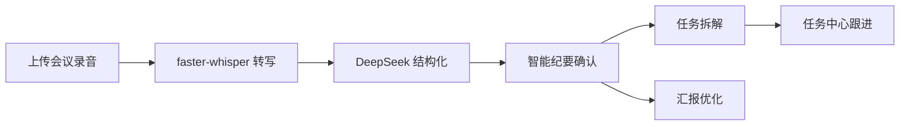

# AI 智能会议助手

> 让会议更高效，让工作更清晰。

面向企业的 **AI 会议效率工具**，覆盖「会议导入 → 智能纪要 → 任务分级 → 汇报优化 → 任务跟进」全链路。

**在线体验仓库：** https://github.com/WENNA-cpu/meeting-assistant.git

---

## 项目简介

在 ToB 职场环境中，会议是信息传递与决策落地的核心场景。本产品旨在解决会后普遍存在的三类问题：

1. **信息碎片化**：会议内容分散在语音、零散笔记中，人工整理耗时且易遗漏
2. **任务难跟进**：会议待办缺乏统一责任人、优先级与截止日期
3. **汇报耗时**：口语化结论转化为结构化汇报需反复打磨

产品以**人机协同**方式，将会议录音转化为结构化纪要、可执行任务和优化后的汇报话术，提升会议信息的结构化与执行落地效率。

---

## 功能模块

| 模块 | 说明 |
|------|------|
| **会议导入** | 音频文件上传（MP3 / WAV / M4A，≤500MB）、处理状态展示 |
| **智能纪要** | 转写展示、四类结构化抽取（决策 / 问题 / 分工 / 待办）、人工确认与编辑 |
| **任务优先级** | 四象限看板、拖拽调级、责任人 / 截止日期管理 |
| **汇报优化** | 多场景 / 风格话术改写、优化前后对比、导出分享 |
| **任务中心** | 按会议分组、状态管理（待处理 / 已完成 / 已延期 / 已拒绝）、逾期提醒、删除会议 |


---

## 技术栈

| 层次 | 技术方案 |
|------|----------|
| 语音转写 | faster-whisper（本地离线模型），备选 FFmpeg whisper |
| 结构化纪要 | DeepSeek API |
| 任务拆解 | 规则引擎 + LLM 辅助分类 |
| 前端 | React 18 + TypeScript + Vite + Tailwind CSS |
| 后端 | FastAPI + SQLAlchemy + SQLite |
| 部署 | Docker Compose + Nginx |


---

## 快速开始

### 环境要求

- **Node.js** 18+
- **Python** 3.11+
- **网络访问**（用于 DeepSeek API 调用）
- （可选）**CUDA 11.x+** 及 GPU 驱动，用于 faster-whisper 加速
- （可选）**FFmpeg**，用于 whisper.cpp 转写

### 安装与运行

```bash
# 克隆仓库
git clone https://github.com/WENNA-cpu/meeting-assistant.git
cd meeting-assistant

# 后端
cd backend
pip install -r requirements.txt
cp .env.example .env
# 编辑 .env 填入 DEEPSEEK_API_KEY 等配置
python -m uvicorn app.main:app --reload --host 127.0.0.1 --port 8000

# 前端（新开终端，回到项目根目录）
npm install
npm run dev
```

浏览器访问 http://localhost:5173 ，API 地址 http://127.0.0.1:8000

### Docker 一键启动

```bash
docker compose up -d --build
```

- 前端：http://localhost
- 后端：http://localhost:8000

### 核心配置项

| 环境变量 | 说明 | 必填 |
|----------|------|------|
| `DEEPSEEK_API_KEY` | DeepSeek API 密钥 | 是 |
| `DEEPSEEK_API_BASE` | API 端点地址 | 否（默认 `https://api.deepseek.com`） |
| `WHISPER_MODEL` | faster-whisper 模型名 | 否（默认 `base`） |
| `HF_ENDPOINT` | Hugging Face 镜像 | 否（默认 `https://hf-mirror.com`） |
| `FFMPEG_PATH` | FFmpeg 可执行文件路径 | 否（Windows 本地转写时需要） |
| `MOCK_TRANSCRIPTION` | 设为 `true` 强制使用演示转写 | 否 |

完整配置见 [backend/.env.example](backend/.env.example)

---

## 用户使用流程



**典型场景：**

1. 上传 Q1 规划会录音 → 确认决策与分工 → 生成任务 → 四象限排优先级
2. 导入多场会议 → 智能纪要页切换查看 → 任务中心统一汇总
3. 内置演示会议可直接体验，无需上传文件

---

## 项目状态

**当前版本：V1.0（MVP）**

### 已实现

- 会议导入（文件上传、处理状态、最近上传列表）
- 语音转写（faster-whisper 本地模型，自动转简体中文）
- 智能纪要（DeepSeek 四类结构化、人工确认 / 编辑、多会议切换）
- 任务优先级（四象限看板、拖拽调级、责任人 / 截止日期）
- 汇报优化（多场景 / 风格、前后对比、导出）
- 任务中心（按会议分组、状态管理、删除会议）
- 主链路：音频上传 → 转写 → 结构化 → 纪要 → 任务拆解 → 任务中心

### V1.1 规划中

- 真实音频转写优化（Whisper 服务稳定性、说话人分离）
- 飞书 / 钉钉任务同步（API 对接）
- 实时录音支持
- 批量任务操作

---

## 目录结构

```
AiMeetWise/
├── backend/                  # FastAPI 后端
│   ├── app/
│   │   ├── api/              # REST API 路由
│   │   ├── models/           # 数据模型
│   │   ├── services/         # 业务逻辑（转写、纪要、任务）
│   │   └── main.py
│   ├── models/               # Whisper 模型缓存
│   ├── uploads/              # 上传音频文件
│   ├── requirements.txt
│   └── .env.example
├── src/                      # React 前端
│   ├── pages/                # 五大功能页面
│   ├── api/                  # 前端 API 封装
│   └── App.tsx
├── docs/                     # 产品文档
│   ├── AI_Meeting_Assistant_PRD.md
│   ├── AI_Meeting_Assistant_Design.md
│   └── images/               # PRD 配图
├── docker-compose.yml
├── package.json
└── README.md
```

---

## 常见问题

**纪要条目数和任务数为什么不一样？**  
只有**已确认**的纪要才会生成任务。请在智能纪要页确认条目后，点击「生成任务」。

**换一场会议，内容会变吗？**  
会。每场会议有独立纪要与任务，在智能纪要页顶部下拉切换即可。

**转写结果是繁体怎么办？**  
系统已接入 `zhconv` 自动转简体；若仍异常，请重新上传或重启后端。

**支持哪些音频格式？**  
MP3、WAV、M4A，单文件不超过 500MB。

---

## 贡献指南

1. Fork 本仓库
2. 创建功能分支：`git checkout -b feature/your-feature`
3. 提交变更：`git commit -m 'feat: 添加 xxx 功能'`
4. 推送到分支：`git push origin feature/your-feature`
5. 提交 Pull Request

### Commit 规范

建议遵循 [Conventional Commits](https://www.conventionalcommits.org/)：

| 类型 | 说明 |
|------|------|
| `feat` | 新功能 |
| `fix` | 修复 |
| `docs` | 文档更新 |
| `style` | 代码格式 |
| `refactor` | 重构 |
| `test` | 测试 |
| `chore` | 构建 / 工具变动 |

---

## 贡献者
   杨文娜
---

## 联系我们

产品反馈与问题请通过 GitHub Issues 提交：  
https://github.com/WENNA-cpu/meeting-assistant/issues

---

## License

内部项目，仅供公司内部使用。未经授权不得对外分发。

---

<p align="center"><i>AI 智能会议助手 — 让每一场会议都有回响。</i></p>
