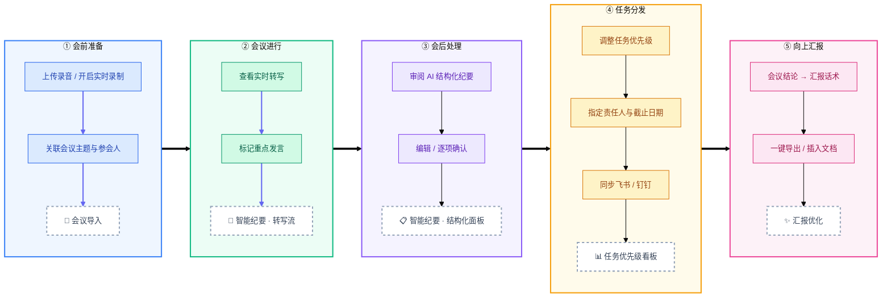
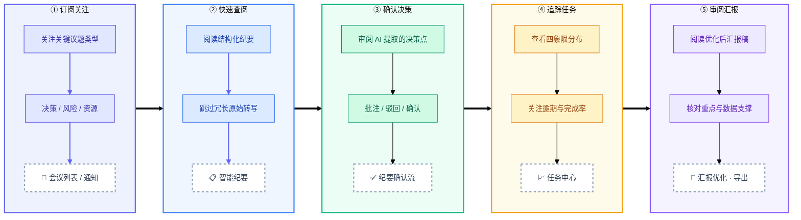
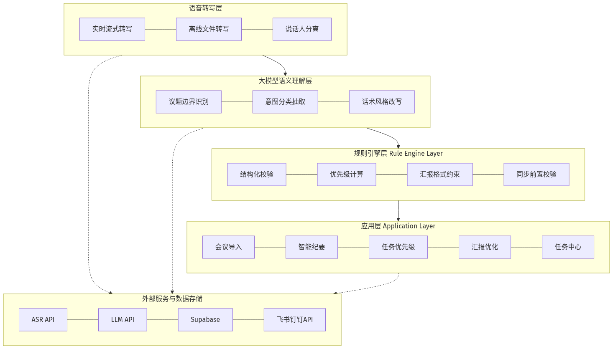
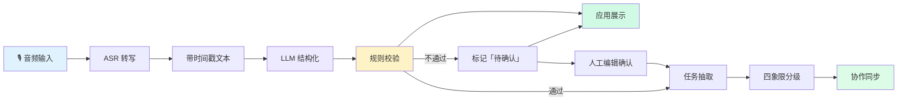
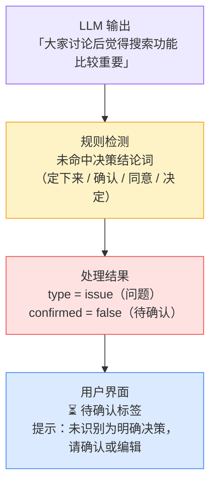
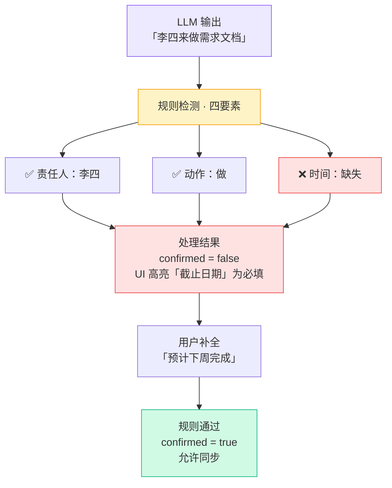
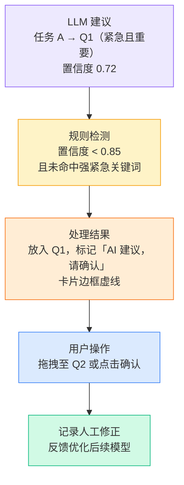
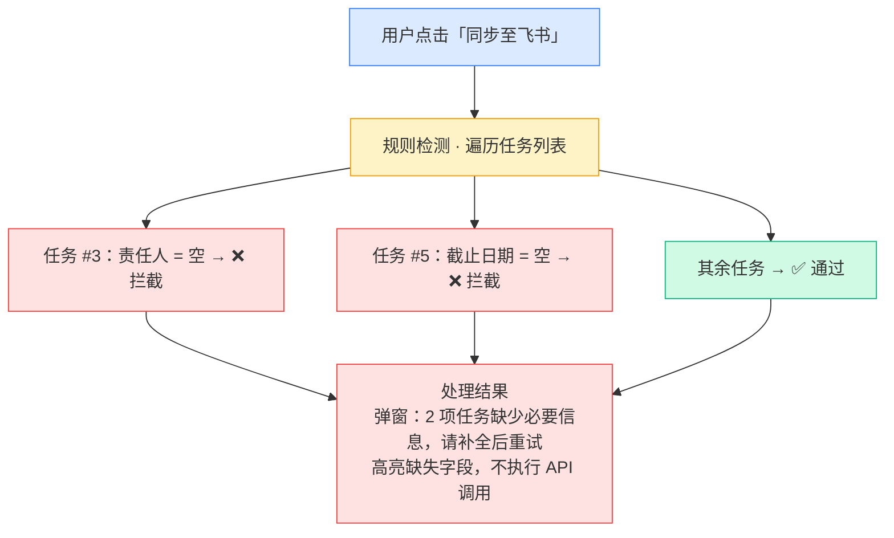
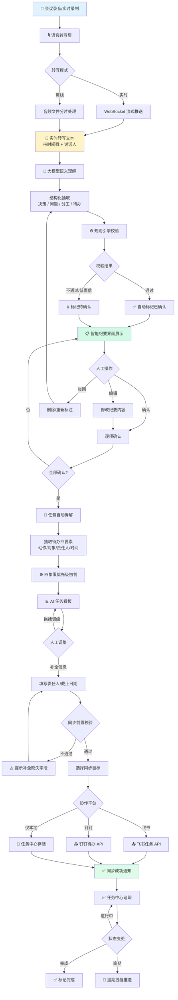

# AI智能会议助手 · 产品设计文档

> **文档版本**：v1.0  
> **产品定位**：To B AI 效率工具  
> **目标用户**：管理者、项目经理、高频汇报岗  
> **核心价值**：解决会议「信息碎片化、任务难跟进、汇报耗时」三大痛点

---

## 目录

1. [产品需求文档 (PRD)](#1-产品需求文档-prd)
2. [产品架构图](#2-产品架构图)
3. [核心交互流程图](#3-核心交互流程图)
4. [高保真原型描述](#4-高保真原型描述)
5. [项目价值总结](#5-项目价值总结)

---

## 1. 产品需求文档 (PRD)

### 1.1 项目背景与痛点

#### 场景一：会议结束，信息散落各处

周五下午 4 点，产品周会刚结束。项目经理张三打开笔记本，发现记了满满三页：有人说了搜索功能要优先、有人提了架构重构、还有人随口说了一句「UI 改版可能要延期」。他花了 40 分钟整理纪要，发给 8 位参会人，结果第二天李四回复：「我负责的需求文档 deadline 是下周还是下下周？」——**原始语音信息碎片化，人工整理成本高，关键决策容易遗漏。**

#### 场景二：任务有了，但没人跟

会后，张三在群里发了一条「@李四 搜索需求文档 @王五 技术方案」，一周后复盘才发现：王五的技术方案还没动笔，而「UI 改版延期到 3 月中旬」这条决策根本没有变成可追踪的待办。**任务从会议到执行的链路断裂，缺乏优先级与责任人绑定。**

#### 场景三：向上汇报，反复打磨话术

周一晨会，张三要向 VP 汇报 Q1 规划进展。他对着 PPT 写了又改：口语化的会议结论不够「汇报感」，数据支撑不足，重点不突出。光打磨 5 分钟汇报稿就花了 1 小时。**从会议结论到管理层可读汇报，中间存在大量重复性文案工作。**

#### 痛点归纳

| 痛点维度  | 具体表现            | 业务影响            |
| ----- | --------------- | --------------- |
| 信息碎片化 | 语音/聊天/笔记分散，结构化难 | 决策追溯困难，信息传递失真   |
| 任务难跟进 | 待办无优先级、无责任人、无同步 | 执行落地率低，跨部门协作摩擦大 |
| 汇报耗时  | 口语转书面、提炼亮点、对齐格式 | 管理者时间被文案工作占用    |

---

### 1.2 用户角色与旅程

#### 角色定义

| 角色      | 典型画像                 | 核心诉求                       |
| ------- | -------------------- | -------------------------- |
| **汇报者** | 项目经理、Team Lead、高频汇报岗 | 快速产出结构化纪要，任务不遗漏，汇报稿专业得体    |
| **管理者** | 部门负责人、VP、业务总监        | 快速掌握会议结论，看清任务优先级与进展，减少信息噪音 |

---

#### 汇报者旅程（Reporter Journey）

| 阶段  | 用户行为                   | 产品触点          | 关键价值         |
| --- | ---------------------- | ------------- | ------------ |
| 会前  | 上传录音/开启实时录制，关联会议主题与参会人 | 会议导入          | 降低启动成本       |
| 会中  | 查看实时转写，标记重点发言          | 智能纪要（左侧转写流）   | 边开边记，不丢信息    |
| 会后  | 审阅 AI 生成的决策/分工/待办，编辑确认 | 智能纪要（右侧结构化面板） | AI 初稿 + 人工把关 |
| 分发  | 调整任务优先级，指定责任人与截止日期     | 任务优先级看板       | 从会议到执行闭环     |
| 汇报  | 将会议结论转化为管理层汇报话术        | 汇报优化          | 节省 60%+ 文案时间 |

---

#### 管理者旅程（Manager Journey）

| 阶段  | 用户行为               | 产品触点      | 关键价值            |
| --- | ------------------ | --------- | --------------- |
| 订阅  | 关注关键议题类型（决策、风险、资源） | 会议列表 / 通知 | 信息降噪，只看关键       |
| 查阅  | 阅读结构化纪要，跳过冗长转写     | 智能纪要      | 3 分钟掌握 1 小时会议   |
| 确认  | 对 AI 提取的决策点进行确认或批注 | 纪要确认流     | 人机协同，降低 AI 幻觉风险 |
| 追踪  | 查看团队任务四象限分布与逾期情况   | 任务中心      | 管理视角，一目了然       |
| 审阅  | 阅读汇报者提交的优化后汇报稿     | 汇报优化（导出）  | 专业、重点突出         |

---

### 1.3 核心功能定义

> 以下五个功能块与产品侧边栏导航一一对应，按用户主流程排列。

#### 功能一：会议导入（Meeting Import）

**功能描述**  
支持上传录音文件或实时录制会议内容，作为后续 AI 转写与结构化分析的输入源，是整个产品工作流的起点。

**输入**

- 离线音频文件（mp3、wav、m4a，单文件最大 500MB）
- 实时麦克风录音流
- 可选：会议主题、参会人名单、议程备注

**处理逻辑**

1. 用户选择「文件上传」或「实时录音」模式
2. 文件上传：校验格式与大小后，分片上传至存储服务
3. 实时录音：通过 WebSocket 流式采集音频，边录边缓存
4. 上传/录制完成后，调用 ASR 服务开始转写，页面展示进度条
5. 转写完成后自动创建会议记录，跳转至智能纪要页

**输出**

- 上传/录制进度与转写进度（百分比）
- 最近上传列表（文件名、时间、处理状态）
- 处理完成后生成会议 ID，供下游模块关联

**交互要点**

- 双模式切换：「文件上传」/「实时录音」Tab 按钮
- 拖拽区支持拖拽与点击上传，显示格式与大小限制提示
- 转写中展示进度条与百分比，处理中文件显示 loading 动画
- 最近上传列表区分「已完成 ✅」与「处理中 🔄」状态
- 处理完成后自动跳转至智能纪要页

---

#### 功能二：智能纪要（Smart Summary）

**功能描述**  
将会议原始语音/文本自动转化为结构化纪要，按「决策」「问题」「分工」「待办」四类标签分类展示，支持人工编辑与逐项确认。

**输入**

- 会议导入模块产出的转写文本（带时间戳、说话人）
- 可选：会议主题、参会人名单、议程模板

**处理逻辑**

1. 语音转写层将音频转为带说话人标识的时间轴文本
2. 大模型语义理解层识别议题边界、决策语句、任务指派句式
3. 规则引擎层校验：决策需有明确结论词（「定下来」「确认」「同意」）；分工需有责任人 + 动作 + 时间
4. 输出结构化卡片，未通过规则校验的条目标记为「待确认」

**输出**

- 左侧：原始转写流（带时间戳、说话人）
- 右侧：结构化纪要卡片（决策 / 问题 / 分工 / 待办）
- 确认状态：已确认 ✅ / 待确认 ⏳

**交互要点**

- 点击转写段落可高亮对应纪要条目（双向联动）
- 支持按类型 Tab 筛选（全部 / 决策 / 分工 / 待办 / 问题）
- 支持单条编辑、删除、手动新增
- 全部确认后可一键导出 Markdown / 发送至飞书文档，或点击「生成任务」进入下一步

---

#### 功能三：任务优先级（Task Priority）

**功能描述**  
从已确认的结构化纪要中自动抽取待办事项，按艾森豪威尔四象限矩阵进行 AI 初判优先级，支持拖拽调整与批量操作，并可同步至协作平台。

**输入**

- 已确认的纪要条目（类型为「分工」「待办」）
- 可选：项目截止日期、团队负载信息

**处理逻辑**

1. 大模型从纪要中抽取「动作 + 对象 + 责任人 + 时间」四要素
2. 规则引擎根据关键词与截止时间计算紧急度：
  - 含「bug」「故障」「阻塞」「今天」「明天」→ 紧急
  - 含「规划」「文档」「调研」且无近期 deadline → 不紧急
3. 重要性由关联决策的优先级（P0/P1）或议题类型推断
4. 输出四象限分布，低置信度任务标记「AI 建议，请确认」

**四象限定义**

| 象限  | 标签    | 颜色   | 处理策略        |
| --- | ----- | ---- | ----------- |
| Q1  | 紧急且重要 | 🔴 红 | 立即执行，每日跟进   |
| Q2  | 重要不紧急 | 🔵 蓝 | 排入计划，防止变 Q1 |
| Q3  | 紧急不重要 | 🟠 橙 | 委派或快速处理     |
| Q4  | 常规任务  | ⚪ 灰  | 批量处理，低优先级   |

**输出**

- 2×2 四象限任务看板（含任务统计栏）
- 任务卡片：描述、责任人、截止日期、置信度标记
- 同步至飞书 / 钉钉的任务映射预览

**交互要点**

- 拖拽任务卡片跨象限调整优先级
- 对「AI 建议，请确认」的低置信度任务进行人工确认
- 支持批量指派、批量设置截止日期
- 点击「确认并同步」推送至协作平台（同步前校验责任人、截止日期必填）

---

#### 功能四：汇报优化（Report Optimization）

**功能描述**  
将会议口语化结论转化为适合向上汇报的结构化话术，提供优化前后对比，支持多种汇报风格（简洁型 / 数据型 / 故事型）。

**输入**

- 已确认的结构化纪要
- 汇报场景：周报 / 月报 / 项目进展 / 风险同步
- 目标受众：直属上级 / VP / 跨部门

**处理逻辑**

1. 大模型按汇报场景重组内容：背景 → 进展 → 问题 → 下一步
2. 规则引擎约束输出格式：
  - 每条结论不超过 2 句
  - 必须包含可量化信息（如有）
  - 禁止口语赘词（「那个」「就是说」「嗯」）
3. 生成优化版本，保留原文对照，并输出变更说明

**输出**

- 左侧：原始会议结论（口语化）
- 右侧：优化后汇报话术（结构化、专业）
- 底部变更说明：结构调整、内容增删、语义强化摘要

**交互要点**

- 选择汇报场景、目标受众与风格后重新生成
- 支持段落级采纳 / 拒绝
- 导出为 Word / 复制到剪贴板 / 插入飞书文档

---

#### 功能五：任务中心（Task Center）

**功能描述**  
汇总各会议产生的待办事项，按会议维度分组展示，提供统一的任务管理与状态跟进看板，并支持与飞书 / 钉钉双向同步。

**输入**

- 智能纪要确认后自动生成的任务
- 任务优先级看板同步推送的任务
- 用户手动创建或编辑的任务

**处理逻辑**

1. 按会议名称 + 会议日期对任务进行分组聚合
2. 根据截止日期计算逾期状态，触发高亮与统计更新
3. 用户变更任务状态（完成 / 延期 / 拒绝）后，回写本地并同步至协作平台
4. 定时轮询或 Webhook 接收外部平台状态变更，保持双向一致

**输出**

- 顶部统计卡片：总任务、待处理、已完成、已逾期
- 按会议分组的任务列表（含优先级、截止日期、状态）
- 筛选与搜索结果

**交互要点**

- 按状态 Tab 筛选（全部 / 待处理 / 已完成），支持搜索任务或会议名称
- 对待处理任务执行「完成」「延期」「拒绝」；已完成任务可「查看」
- 逾期任务红色高亮，优先级分为高 / 中 / 低三档
- 支持批量操作（批量完成、批量延期等）

---

### 1.4 非功能需求

| 维度  | 要求                                   |
| --- | ------------------------------------ |
| 性能  | 实时转写延迟 < 3s；结构化处理 < 30s（1 小时会议）      |
| 安全  | 音频数据加密传输与存储；支持企业私有化部署                |
| 兼容性 | 支持飞书、钉钉 OAuth 集成；主流浏览器 Chrome / Edge |
| 可用性 | 核心流程 3 步内完成；支持深色模式                   |

---

## 2. 产品架构图

### 2.1 分层架构总览

> **图例**：应用层五个模块与侧边栏导航一一对应；实线箭头为数据上行，虚线箭头为外部 API 调用。

**应用层与五大功能的关系**

| 架构图中的模块 | 是否独立导航页 | 说明 |
|---------------|---------------|------|
| 会议导入 | ✅ 是 | 侧边栏入口，对应 `MeetingImport` |
| 智能纪要 | ✅ 是 | 侧边栏入口，对应 `SmartSummary` |
| 任务优先级 | ✅ 是 | 侧边栏入口，对应 `TaskPriority` |
| 汇报优化 | ✅ 是 | 侧边栏入口，对应 `ReportOptimize` |
| 任务中心 | ✅ 是 | 侧边栏入口，对应 `TaskCenter` |

**不在应用层单独列出的横切能力**（嵌入在上述模块或外部服务层，**不是第六、第七个导航功能**）：

| 能力 | 实际落点 | 当前实现 |
|------|---------|---------|
| **协作同步**（飞书 / 钉钉） | 任务优先级「同步至飞书」、任务中心状态回写、汇报优化「插入飞书文档」、智能纪要「导出纪要」 | 按钮与 API 集成能力，无独立页面 |
| **管理看板**（管理者视角） | 管理者旅程中的「订阅 / 查阅 / 追踪」能力，分散在智能纪要、任务中心 | 产品规划概念，**尚无** `ManagerView` 独立页面 |

因此架构图应用层只展示 **5 个与代码一致的功能模块**；协作同步体现在应用层 → 外部服务的虚线，管理视角通过任务中心与智能纪要的组合满足。

### 2.2 数据流向

### 2.3 「规则兜底」在人机协同中的生效机制

AI 擅长语义理解，但在 To B 场景下存在幻觉、格式不一致、关键信息遗漏等风险。**规则引擎层作为「安全网」，在 LLM 输出与应用展示之间插入确定性校验，确保关键业务逻辑不被 AI 不确定性破坏。**

#### 机制一：结构化校验兜底

**价值**：防止将模糊讨论误标为已确认决策，避免后续任务同步基于错误前提。

#### 机制二：分工四要素校验

**价值**：确保同步到飞书/钉钉的任务具备可执行性，避免「有任务无 deadline」的跟进黑洞。

#### 机制三：优先级置信度分级

**价值**：AI 给建议，人做最终判断；既不阻塞流程，又保留人工裁量权。

#### 机制四：同步前置拦截

**价值**：避免脏数据进入企业协作系统，保护团队任务看板的可信度。

#### 人机协同原则总结

| 环节  | AI 负责  | 规则引擎负责    | 人负责       |
| --- | ------ | --------- | --------- |
| 转写  | 语音识别   | 格式规范化     | 修正识别错误    |
| 结构化 | 语义分类抽取 | 结论词/四要素校验 | 确认/编辑/驳回  |
| 优先级 | 初判四象限  | 置信度阈值、关键词 | 拖拽调整、最终确认 |
| 汇报  | 话术改写   | 格式/长度约束   | 采纳/拒绝段落   |
| 同步  | 字段映射   | 前置必填校验    | 触发同步操作    |

**设计哲学**：AI 做「80% 的初稿」，规则做「100% 的底线校验」，人做「关键 20% 的裁量」。

---

## 3. 核心交互流程图

---

## 4. 高保真原型描述

以下五个界面与产品侧边栏五大功能模块一一对应，按用户主流程排列：**会议导入 → 智能纪要 → 任务优先级 → 汇报优化 → 任务中心**。

---

### 4.1 会议导入

**页面路径**：侧边栏 → 会议导入  
**对应功能**：会议音频/录音的入口，是整个工作流的起点  
**代码路径**：`src/pages/MeetingImport.tsx`

会议导入界面

#### 界面布局说明

| 区域   | 组件               | 交互行为                                       |
| ---- | ---------------- | ------------------------------------------ |
| 页头   | 标题「会议导入」+ 功能说明   | 说明支持上传录音或实时录制，AI 将自动生成结构化纪要                |
| 操作切换 | 「文件上传」/「实时录音」双按钮 | 切换上传模式与实时录制模式                              |
| 上传区  | 虚线拖拽区域 + 文件图标    | 支持拖拽或点击上传；格式限制 MP3 / WAV / M4A，单文件最大 500MB |
| 最近上传 | 历史文件列表           | 展示文件名、上传时间、处理状态（✅ 已完成 / 🔄 处理中）            |
| 侧边栏  | 五大功能导航 + 使用提示    | 当前页高亮「会议导入」；底部提示引导用户从导入开始完整流程              |

#### 设计要点

- 降低启动门槛：拖拽上传 + 实时录音双入口，适配会前准备与会中录制两种场景。
- 处理状态可见：列表区分「已完成」与「处理中」，避免用户重复上传或不知进度。
- 作为流程起点，与后续「智能纪要」「任务优先级」形成清晰的前后衔接。

---

### 4.2 智能纪要（会议实时转写与结构化纪要）

**页面路径**：侧边栏 → 智能纪要  
**对应功能**：智能纪要 — 左侧实时转写，右侧 AI 结构化输出  
**代码路径**：`src/pages/SmartSummary.tsx`

智能纪要界面

#### 界面布局说明

| 区域         | 组件                     | 交互行为                       |
| ---------- | ---------------------- | -------------------------- |
| 顶栏         | 会议标题、时间、参会人            | 展示「Q1产品规划周会」及参会人张三/李四/王五   |
| 确认进度       | 进度条「已确认 2/7」           | 实时反馈人工确认进度                 |
| 全局操作       | 「一键确认全部」「导出纪要」         | 批量确认或导出结构化纪要               |
| 左侧 · 原始转写  | REC 状态 + 计时器 + 对话流     | 按时间戳与说话人展示转写；当前播放位置高亮联动    |
| 右侧 · 结构化纪要 | 分类 Tab（全部/决策/分工/待办/问题） | 按类型筛选 AI 抽取条目              |
| 纪要卡片       | 决策/分工/问题等待办卡片          | 已确认 ✅ / 待确认 ⏳；支持编辑、确认、查看来源 |
| 底部操作       | 「导出纪要」「生成任务 →」         | 全部确认后跳转任务拆解流程              |

#### 设计要点

- **左右分栏联动**：转写与纪要双向定位，点击来源可回溯原始发言，体现人机协同可追溯性。
- **分类标签 + 确认流**：决策（黄）、分工（蓝）、问题（红）等颜色编码，待确认项强制人工把关后方可进入下游。
- **规则兜底可视化**：未通过校验的条目标记「待确认」，而非静默当作已确认决策。

---

### 4.3 任务优先级（AI 任务看板 · 四象限）

**页面路径**：侧边栏 → 任务优先级  
**对应功能**：任务拆解与分级 — 艾森豪威尔四象限矩阵  
**代码路径**：`src/pages/TaskPriority.tsx`

任务优先级看板界面

#### 界面布局说明

| 区域    | 组件                                 | 交互行为                            |
| ----- | ---------------------------------- | ------------------------------- |
| 页头    | 标题 + 来源会议 + 同步/刷新                  | 「来自: Q1产品规划周会」；支持「同步至飞书」下拉与刷新   |
| 统计栏   | 各象限任务数量汇总                          | 总计 6 项：🔴 2 / 🔵 2 / 🟠 1 / ⚪ 1 |
| 四象限看板 | 2×2 矩阵（紧急且重要 / 重要不紧急 / 紧急不重要 / 常规） | 拖拽卡片跨象限调整优先级                    |
| 任务卡片  | 描述、责任人、截止日期、拖拽手柄                   | 逾期任务标红「逾期」；低置信度显示「AI建议，请确认」     |
| 底栏操作  | 手动添加、批量指派、批量设截止日期、「确认并同步」          | 同步前执行规则校验，缺失字段阻断并高亮             |

#### 设计要点

- **四象限可视化**：颜色编码（红/蓝/橙/灰）直观传达优先级，管理者一眼掌握任务分布。
- **AI 建议 + 人工裁量**：虚线边框与「AI建议，请确认」标签，体现低置信度结果需人工确认。
- **同步闭环**：「确认并同步」对接飞书/钉钉，完成从会议到协作平台的任务分发。

---

### 4.4 汇报优化（汇报话术重构）

**页面路径**：侧边栏 → 汇报优化  
**对应功能**：汇报话术重构 — 优化前后文本对比  
**代码路径**：`src/pages/ReportOptimize.tsx`

汇报话术优化界面

#### 界面布局说明

| 区域       | 组件                        | 交互行为                                 |
| -------- | ------------------------- | ------------------------------------ |
| 场景配置     | 汇报场景、目标受众、风格 Tab          | 场景「项目进展」、受众「直属上级」；风格：简洁型 / 数据型 / 故事型 |
| 来源标注     | 「来源会议: Q1产品规划周会」          | 关联上游会议纪要，保证上下文一致                     |
| 左侧 · 优化前 | 会议口语原文                    | 保留原始表述，含口语赘词与松散结构                    |
| 右侧 · 优化后 | 结构化汇报话术                   | 四段式：核心进展 → 任务分工 → 风险与应对 → 下一步计划      |
| 变更说明     | 结构调整 / 新增内容 / 删减内容 / 语义强化 | 透明展示 AI 改写逻辑，增强用户信任                  |
| 底栏操作     | 重新生成、复制、导出 Word、插入飞书文档    | 字数对比 134 → 194（+45%）                 |

#### 设计要点

- **左右对比**：原文与优化稿并列，用户可逐段审阅，拒绝盲目采纳 AI 输出。
- **规则引擎约束**：自动去除口语赘词、补充交付日期、强化决策表述（「定下来」→「经会议确认」）。
- **多风格适配**：简洁型 / 数据型 / 故事型满足不同汇报场景与受众需求。

---

### 4.5 任务中心（待办跟进）

**页面路径**：侧边栏 → 任务中心  
**对应功能**：待办跟进 — 按会议维度聚合任务，支持状态管理与操作  
**代码路径**：`src/pages/TaskCenter.tsx`

个人任务中心界面

#### 界面布局说明

| 区域    | 组件                         | 交互行为                      |
| ----- | -------------------------- | ------------------------- |
| 页头    | 标题「个人任务中心」+ 说明 + 批量操作      | 按会议维度查看和管理全部待办            |
| 统计卡片  | 总任务 / 待处理 / 已完成 / 已逾期      | 四色卡片（蓝/黄/绿/红）快速概览工作量      |
| 筛选栏   | 状态 Tab + 搜索框 + 筛选按钮        | 按「全部/待处理/已完成」筛选；支持搜索任务或会议 |
| 任务分组  | 按会议分组（技术架构讨论、用户需求分析会、周例会…） | 每组显示会议日期与任务数量             |
| 任务条目  | 优先级标签、截止日期、操作按钮            | 待处理：完成 / 延期 / 拒绝；已完成：查看   |
| 优先级标签 | 高优先级（红）、中优先级（橙）            | 与上游四象限分级保持一致              |

#### 设计要点

- **会议维度聚合**：任务按来源会议分组，便于追溯「这场会产生了哪些待办」。
- **状态闭环**：完成 / 延期 / 拒绝三种操作覆盖真实职场场景，支持双向同步至飞书/钉钉。
- **逾期预警**：统计卡片与条目级标红，帮助汇报者和管理者及时跟进滞后任务。

---

## 5. 项目价值总结

### 多角色需求拆解能力

本产品从立项之初即识别出「汇报者」与「管理者」两类核心用户，其诉求存在本质差异：

- **汇报者**需要的是**生产效率**——从会议结束到纪要发出、任务同步、汇报稿提交，每一步都在与 deadline 赛跑。产品为其设计了「导入 → 结构化 → 确认 → 分发 → 优化」的线性高效路径，核心指标是「会后 15 分钟内完成全部收尾」。
- **管理者**需要的是**信息降噪与管控力度**——他们不需要阅读逐字转写，而是要快速定位决策、判断风险、追踪任务。产品为其设计了「结构化摘要 → 确认流 → 任务看板 → 逾期提醒」的俯瞰视角，核心指标是「3 分钟掌握 1 小时会议结论」。

同一套数据（会议转写），通过不同功能模块的组合，服务于不同角色的差异化场景，避免了「一套界面打天下」的产品偷懒。

### AI 边界把控能力

在 AI 能力边界日益模糊的今天，本产品坚持「AI 建议 + 规则兜底 + 人工确认」的三层架构：

1. **不替代人做判断**：AI 生成的结构化纪要、优先级建议、汇报话术均为「初稿」，关键节点（决策确认、任务同步）必须经人工确认后方可生效。
2. **规则引擎兜底确定性**：决策结论词检测、分工四要素校验、同步前置拦截等规则，确保 AI 的「创造性」不会破坏业务的「确定性」。
3. **置信度透明化**：低置信度结果以视觉标记（⏳ 待确认、虚线边框、⚠️ 提示）暴露给用户，而非静默输出错误结果。
4. **人机协同反馈闭环**：用户的人工修正（编辑纪要、拖拽优先级、拒绝汇报段落）可作为后续模型优化的训练信号，形成越用越准的飞轮。

这套设计哲学体现的是：**AI 是加速器，不是自动驾驶**——在 To B 场景下，信任比炫技更重要。

---

## 附录

### A. 功能模块与代码映射

| 产品设计模块 | 代码路径                           | 状态  |
| ------ | ------------------------------ | --- |
| 会议导入   | `src/pages/MeetingImport.tsx`  | 已实现 |
| 智能纪要   | `src/pages/SmartSummary.tsx`   | 已实现 |
| 任务优先级  | `src/pages/TaskPriority.tsx`   | 已实现 |
| 汇报优化   | `src/pages/ReportOptimize.tsx` | 已实现 |
| 任务中心   | `src/pages/TaskCenter.tsx`     | 已实现 |

### B. 术语表

| 术语    | 定义                                 |
| ----- | ---------------------------------- |
| 结构化纪要 | 将原始转写按决策/问题/分工/待办分类的结构化输出          |
| 四象限   | 艾森豪威尔矩阵：紧急且重要 / 重要不紧急 / 紧急不重要 / 常规 |
| 规则兜底  | 在 LLM 输出后执行的确定性校验，确保业务逻辑正确性        |
| 待确认   | AI 生成但未经人工确认的内容，不可进入下游流程           |

---

*文档结束 · AI智能会议助手产品组*