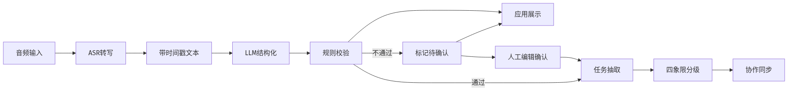
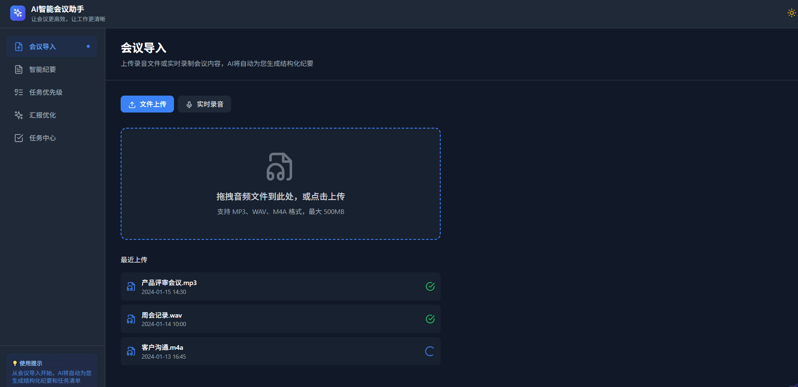
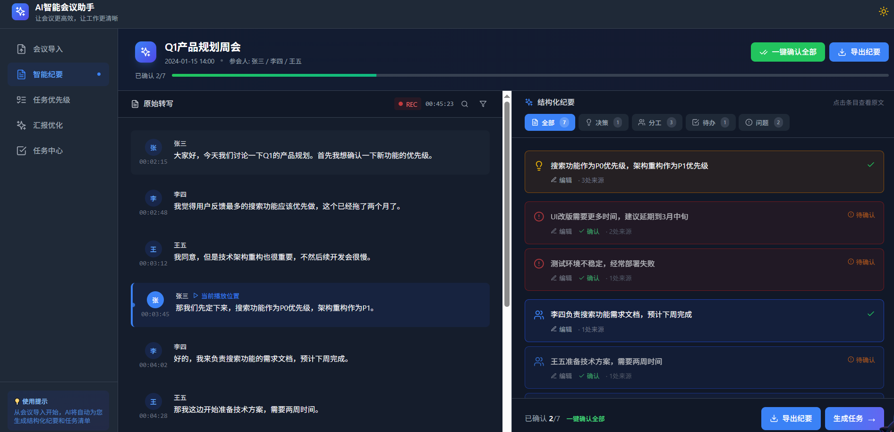
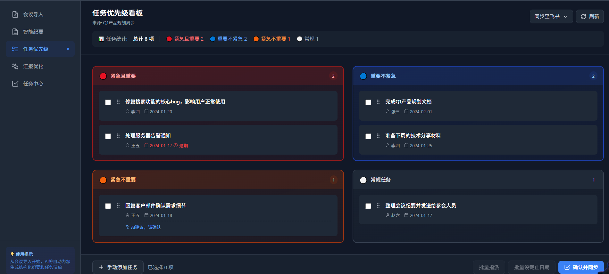
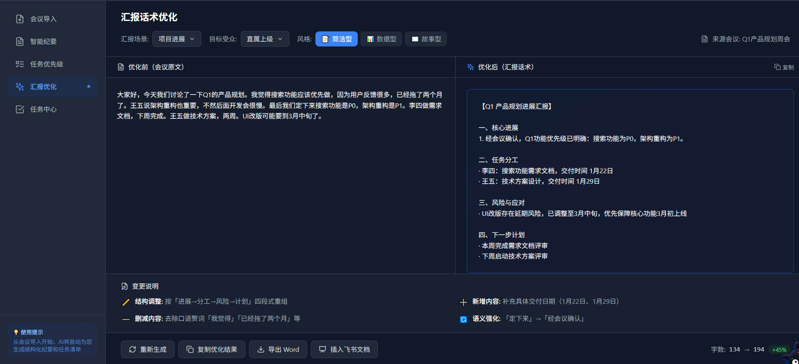
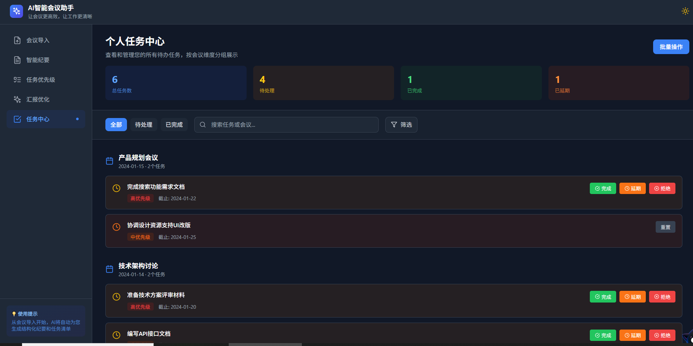

# AI 智能会议助手 · 产品需求文档（PRD）

---

## 1. 文档信息

| 项目 | 内容 |
|------|------|
| 产品名称 | AI 智能会议助手 |
| 文档版本 | v2.0 |
| 创建日期 | 2026-06-18 |
| 更新日期 | 2026-06-19 |
| 文档负责人 | 杨文娜 |
| 评审人 | 待定 |
| 文档状态 | 个人定稿 |
| 保密级别 | 内部公开 |

---

## 2. 修订记录

| 版本 | 日期 | 修订人 | 修订内容 |
|------|------|--------|----------|
| v1.0 | 2026-06-18 | 杨文娜 | 初版 PRD，定义核心功能与业务流程 |
| v2.0 | 2026-06-19 | 杨文娜 | 按企业级规范重构，对齐五大功能模块，去除技术实现描述 |

---

## 3. 项目背景与目标

### 3.1 背景

在 To B 职场环境中，会议是信息传递与决策落地的核心场景。管理者、项目经理及高频汇报岗位每周参与大量会议，会后普遍面临三类问题：

1. **信息碎片化**：会议内容以语音、零散笔记、群聊消息等形式分散留存，人工整理纪要耗时长，关键决策易遗漏或失真。
2. **任务难跟进**：会议中形成的待办缺乏统一责任人、优先级与截止日期，难以从「讨论」闭环到「执行」。
3. **汇报耗时**：会议结论多为口语表达，转化为面向管理层的结构化汇报需反复打磨，占用大量文案时间。

市场已有会议录音与转写类产品，但多数停留在「转文字」层面，缺少结构化纪要、任务分级、汇报话术等企业场景所需的端到端能力。

### 3.2 产品定位

面向企业的 **AI 会议效率工具**，覆盖「会议导入 → 智能纪要 → 任务分级 → 汇报优化 → 任务跟进」全链路，以人机协同方式提升会议信息结构化与执行落地效率。

### 3.3 产品目标

| 目标维度 | 目标描述 | 衡量指标（建议） |
|----------|----------|------------------|
| 效率提升 | 缩短会后纪要整理与汇报准备时间 | 汇报者会后 15 分钟内完成纪要确认与任务分发 |
| 信息质量 | 提升会议结论的结构化与可追溯性 | 管理者 3 分钟内掌握 1 小时会议核心结论 |
| 执行闭环 | 提高会议待办的跟进与完成率 | 任务同步至协作平台后 7 日完成率提升 |
| 用户信任 | 确保 AI 输出可审阅、可修正、可确认 | 关键决策 100% 经人工确认后方可进入下游 |

### 3.4 成功标准

- 核心用户（汇报者）周活跃率达到预期阈值
- 智能纪要确认率 ≥ 80%
- 任务同步至飞书/钉钉的成功率 ≥ 95%
- 用户满意度（NPS 或满意度调研）达到业务线基准以上

---

## 4. 用户与场景

### 4.1 目标用户

| 用户角色 | 典型画像 | 核心诉求 |
|----------|----------|----------|
| **汇报者** | 项目经理、Team Lead、业务骨干、高频汇报岗 | 快速产出结构化纪要；任务不遗漏；汇报稿专业得体 |
| **管理者** | 部门负责人、总监、VP | 快速掌握会议结论；看清任务优先级与进展；减少信息噪音 |

### 4.2 核心使用场景

#### 场景 A：会后整理纪要（汇报者）

会议结束后，汇报者上传录音或导入已录制文件，系统自动转写并生成结构化纪要。汇报者审阅、编辑并确认决策与分工后，导出纪要或进入任务分发环节。

#### 场景 B：会中边开边记（汇报者）

会议进行中开启实时录音，同步查看转写内容并标记重点发言，避免会后信息缺失。

#### 场景 C：任务分发与协作同步（汇报者）

从已确认纪要中自动抽取待办，按四象限调整优先级并指定责任人与截止日期，一键同步至飞书或钉钉。

#### 场景 D：向上汇报准备（汇报者）

将会议口语化结论转化为适合周报、项目进展汇报等场景的结构化话术，支持优化前后对比与一键导出。

#### 场景 E：管理视角跟进（管理者）

管理者阅读结构化纪要（而非冗长转写），确认关键决策，在任务中心查看团队待办分布、逾期与完成情况，审阅汇报者提交的优化后汇报稿。

### 4.3 用户旅程概览

**汇报者主路径**：会前导入 → 会中转写 → 会后确认纪要 → 任务分级与同步 → 汇报优化

**管理者主路径**：订阅关注 → 查阅结构化纪要 → 确认决策 → 追踪任务 → 审阅汇报

---

## 5. 功能范围（MoSCoW 优先级）

### Must Have（V1.0 必须交付）

| 功能模块 | 说明 |
|----------|------|
| 会议导入 | 文件上传、实时录音、处理状态展示 |
| 智能纪要 | 转写展示、四类结构化抽取、人工确认与编辑 |
| 任务优先级 | 四象限看板、拖拽调级、责任人/截止日期管理 |
| 汇报优化 | 优化前后对比、多场景与风格、导出分享 |
| 任务中心 | 按会议分组、状态管理、逾期提醒 |
| 协作同步 | 任务同步至飞书/钉钉（嵌入任务优先级与任务中心） |

### Should Have（V1.x 建议交付）

| 功能 | 说明 |
|------|------|
| 会议列表与历史检索 | 按时间、主题、参会人检索历史会议 |
| 纪要导出多格式 | 支持导出为文档、发送至协作平台文档 |
| 批量任务操作 | 批量指派、批量设截止日期、批量完成 |
| 会议通知与订阅 | 管理者订阅关键议题类型通知 |

### Could Have（V2.0 可选）

| 功能 | 说明 |
|------|------|
| 独立管理者看板 | 团队维度任务完成率、逾期统计、会议效率报表 |
| 多语言会议支持 | 中英文混合会议转写与纪要 |
| 议程模板 | 会前导入议程，会中按议题对齐纪要结构 |
| 钉钉深度集成 | 与钉钉日历、审批流联动 |

### Won't Have（本期不做）

| 功能 | 说明 |
|------|------|
| 视频会议内置录制 | 本期不替代腾讯会议、飞书会议等原生录制 |
| 实时多人协同编辑纪要 | 本期以单人确认流为主 |
| 自定义 AI 模型训练平台 | 本期不提供企业自训练入口 |

---

## 6. 产品架构

会议助手采用四层架构设计，从底层到上层依次为：

- **语音转写层（ASR）**：实时流式转写、离线文件转写、说话人分离
- **LLM 语义理解层**：议题边界识别、意图分类抽取、话术风格改写
- **规则引擎层**：结构化校验规则、优先级计算规则、汇报格式约束规则
- **应用层**：会议导入、智能纪要、任务优先级、汇报优化、任务中心

> 图：会议助手四层架构，语音转写 → LLM 语义理解 → 规则引擎 → 应用层。

---

## 7. 业务流程

用户上传录音 → ASR 转写 → LLM 结构化 → 规则引擎校验 → 输出结构化纪要 → 任务拆解 → 任务中心

> 图：数据从录音输入到任务输出的完整流转路径。

---

## 8. 功能详情

### 功能一：会议导入

**用户故事**

作为会议参与者，我想要上传会议录音或实时录制会议内容，以便系统自动分析并生成结构化纪要。

**交互简述**

1. 用户进入「会议导入」页面。
2. 选择「文件上传」或「实时录音」模式。
3. 上传文件：拖拽或点击选择音频；实时录音：点击开始/结束录制。
4. 可选填写会议主题、参会人、议程备注。
5. 系统展示上传/录制及分析进度。
6. 分析完成后自动跳转至「智能纪要」页面。

  

 
**业务规则**

- 支持音频格式：MP3、WAV、M4A。
- 单文件最大：500MB。
- 上传区支持拖拽与点击两种方式。
- 「最近上传」列表展示文件名、时间、处理状态（已完成 / 处理中）。
- 分析完成后自动跳转至智能纪要页。
- 同一用户可保留最近上传记录，支持从历史记录重新进入对应会议。

**异常处理**

| 异常情况 | 系统响应 |
|----------|----------|
| 文件格式不支持 | 提示「请上传 MP3、WAV 或 M4A 格式文件」 |
| 文件超过大小限制 | 提示「文件超过 500MB，请压缩后重试」 |
| 上传中断或网络失败 | 提示「上传失败，请检查网络后重试」，保留已选文件信息 |
| 实时录音权限未授权 | 提示「请允许麦克风权限后重试」 |
| 分析处理超时 | 提示「处理时间较长，请稍后刷新查看结果」，列表保持「处理中」状态 |
| 分析失败 | 提示「分析失败，请重新上传或联系管理员」，记录失败原因供客服排查 |

---

### 功能二：智能纪要

**用户故事**

作为会议组织者，我想要将会议录音自动转化为结构化纪要，并能逐项确认或修改，以便准确传达会议结论并作为下游任务与汇报的依据。

**交互简述**

1. 用户进入「智能纪要」页面，顶部展示会议主题、时间、参会人及确认进度。
2. 左侧查看原始转写流（时间戳 + 说话人）；右侧查看 AI 结构化结果。
3. 点击左侧转写段落，高亮右侧对应纪要条目（双向联动）。
4. 按 Tab 筛选：全部 / 决策 / 分工 / 待办 / 问题。
5. 对每条纪要执行：编辑、确认、删除；支持手动新增条目。
6. 支持「一键确认全部」「导出纪要」「生成任务」。

  

 
**业务规则**

- 结构化分类固定为四类：决策、问题、分工、待办。
- 决策类条目须包含明确结论表述（如「确认」「同意」「定下来」），否则标记为「待确认」。
- 分工类条目须包含责任人、动作描述；建议包含截止时间，缺失时标记「待确认」。
- 仅「已确认」条目可进入任务拆解与同步流程。
- 确认进度实时展示（如「已确认 2/7」）。
- 导出纪要支持发送至协作平台文档或本地文档格式。

**异常处理**

| 异常情况 | 系统响应 |
|----------|----------|
| 转写内容为空或极短 | 提示「未识别到有效语音内容，请检查录音质量」 |
| AI 结构化生成失败 | 展示原始转写，提示「结构化生成失败，可手动添加纪要条目」 |
| 用户未确认即点击「生成任务」 | 弹窗提示「尚有 N 条待确认，确认后继续或返回编辑」 |
| 编辑内容与原始转写严重冲突 | 保留用户编辑结果，标记为「人工修订」 |
| 导出失败 | 提示「导出失败，请稍后重试」 |

---

### 功能三：任务优先级

**用户故事**

作为项目经理，我想要将会议待办按紧急与重要程度分级展示，并能调整优先级、指定责任人与截止日期，以便团队清晰执行并同步至协作平台。

**交互简述**

1. 用户从智能纪要「生成任务」进入，或直接进入「任务优先级」页面。
2. 查看四象限看板及顶部任务统计（各象限数量）。
3. 拖拽任务卡片跨象限调整优先级。
4. 编辑任务描述、责任人、截止日期。
5. 对标记「AI 建议，请确认」的任务进行人工确认。
6. 支持批量指派、批量设置截止日期。
7. 点击「确认并同步」，选择飞书或钉钉完成推送。

  

 
**业务规则**

- 四象限定义：
  - **紧急且重要**：需立即执行，每日跟进。
  - **重要不紧急**：纳入计划，防止演变为紧急任务。
  - **紧急不重要**：委派或快速处理。
  - **常规任务**：低优先级批量处理。
- 任务来源为智能纪要中已确认的「分工」「待办」类条目。
- AI 初判优先级时，低置信度任务须标记「AI 建议，请确认」，虚线边框展示。
- 同步前校验：每条任务须填写责任人与截止日期，缺失则拦截并高亮字段。
- 逾期任务以红色标注截止日期。
- 看板顶部展示来源会议名称。

**异常处理**

| 异常情况 | 系统响应 |
|----------|----------|
| 无可拆解任务 | 提示「请先在智能纪要中确认分工或待办条目」 |
| 同步前必填项缺失 | 弹窗「N 项任务缺少责任人或截止日期」，高亮缺失项 |
| 协作平台授权失效 | 提示「协作平台授权已过期，请重新授权后同步」 |
| 部分任务同步失败 | 展示成功/失败清单，支持对失败项重试 |
| 拖拽后未保存即离开 | 提示「优先级已变更，是否保存？」 |

---

### 功能四：汇报优化

**用户故事**

作为需要向上汇报的业务负责人，我想要将会议口语化结论转化为专业、结构化的汇报话术，并能对比优化前后差异，以便节省文案时间并提升汇报质量。

**交互简述**

1. 用户进入「汇报优化」页面。
2. 选择汇报场景（如项目进展、周报、风险同步）、目标受众（直属上级、VP、跨部门）、汇报风格（简洁型、数据型、故事型）。
3. 左侧查看会议原文（口语化）；右侧查看 AI 优化后的汇报话术。
4. 阅读底部「变更说明」（结构调整、内容增删、语义强化）。
5. 对优化结果执行：重新生成、段落采纳/拒绝、复制、导出文档、插入协作平台文档。

  

 
**业务规则**

- 优化内容默认按「核心进展 → 任务分工 → 风险与应对 → 下一步计划」结构组织。
- 单条结论建议不超过两句；自动过滤明显口语赘词。
- 尽可能补充可量化信息（日期、完成度、数量等，以会议原文为依据）。
- 保留原文对照，变更说明须透明展示 AI 改写逻辑。
- 字数统计展示优化前后对比。

**异常处理**

| 异常情况 | 系统响应 |
|----------|----------|
| 无可用纪要来源 | 提示「请先完成智能纪要确认」 |
| 优化生成失败 | 提示「生成失败，请稍后重试」，保留原文 |
| 生成内容为空 | 提示「未生成有效内容，请调整场景或风格后重试」 |
| 复制/导出失败 | 提示「操作失败，请检查权限或网络后重试」 |
| 用户拒绝全部优化段落 | 保留原文，提示「已恢复为会议原文」 |

---

### 功能五：任务中心

**用户故事**

作为会议参与人，我想要在统一页面查看各会议产生的待办、按状态筛选并更新进度，以便不漏项、不逾期，并与协作平台保持同步。

**交互简述**

1. 用户进入「任务中心」页面。
2. 顶部统计卡片查看：总任务、待处理、已完成、已逾期。
3. 按状态 Tab 筛选（全部 / 待处理 / 已完成），或搜索任务/会议名称。
4. 任务按来源会议分组展示（会议名称、日期、任务数）。
5. 对待处理任务：完成、延期、拒绝；对已完成任务：查看详情。
6. 支持批量操作入口。

  

 
**业务规则**

- 任务来源：智能纪要确认后自动生成，或从任务优先级看板同步而来。
- 按会议名称 + 会议日期分组展示。
- 任务状态：待处理、已完成、已延期、已拒绝。
- 优先级：高、中、低三档，与四象限分级对应。
- 逾期任务红色高亮，统计卡片同步更新逾期数量。
- 状态变更支持回写至飞书/钉钉（双向同步，以授权范围为准）。
- 已完成任务不可再执行「完成」，仅可查看。

**异常处理**

| 异常情况 | 系统响应 |
|----------|----------|
| 无任务数据 | 展示空状态引导「从会议导入开始，完成纪要确认后将自动生成任务」 |
| 状态同步至协作平台失败 | 本地状态保留，提示「同步失败，将稍后重试」并支持手动重试 |
| 批量操作部分失败 | 展示成功/失败明细 |
| 搜索无结果 | 提示「未找到匹配任务，请调整关键词」 |
| 任务已被他人更新 | 提示「任务状态已更新，请刷新后查看」 |

---

## 9. 非功能需求

### 9.1 性能

| 指标 | 要求 |
|------|------|
| 实时转写延迟 | 会中实时转写展示延迟 &lt; 3 秒（正常网络条件下） |
| 离线分析时长 | 1 小时会议录音，结构化纪要生成 &lt; 30 秒（标准负载下） |
| 页面响应 | 核心页面首屏加载 &lt; 2 秒 |
| 并发支持 | 满足企业标准席位规模下的日常使用并发 |

### 9.2 安全与合规

| 维度 | 要求 |
|------|------|
| 数据传输 | 会议音频及纪要数据全程加密传输 |
| 数据存储 | 企业数据隔离存储，支持按企业策略配置保留周期 |
| 权限控制 | 会议与任务按企业组织架构与角色授权访问 |
| 审计留痕 | 关键操作（确认纪要、同步任务、导出汇报）留痕可追溯 |
| 合规 | 符合企业信息安全与数据出境相关内部规范 |

### 9.3 可用性

| 维度 | 要求 |
|------|------|
| 易学性 | 核心流程（导入 → 纪要 → 任务）3 步内可完成主路径 |
| 无障碍 | 支持深色模式，关键状态具备颜色与文字双重标识 |
| 协作集成 | 支持飞书、钉钉账号授权与待办同步 |
| 浏览器 | 支持 Chrome、Edge 等主流浏览器最新两个大版本 |

### 9.4 可靠性

| 维度 | 要求 |
|------|------|
| 服务可用性 | 核心功能月度可用性 ≥ 99.5%（企业 SLA 另行约定） |
| 数据备份 | 会议与任务数据定期备份，支持灾难恢复 |
| 失败恢复 | 上传、分析、同步失败均支持重试，不丢失用户已确认内容 |

---

## 10. 版本规划

### 10.1 V1.0（MVP）— 当前目标版本

**目标**：打通「会议导入 → 智能纪要 → 任务优先级 → 汇报优化 → 任务中心」主链路。

| 交付项 | 说明 |
|--------|------|
| 五大功能模块 | 会议导入、智能纪要、任务优先级、汇报优化、任务中心 |
| 协作同步 | 飞书、钉钉任务同步与状态回写 |
| 人机协同 | 纪要确认流、同步前置校验、AI 建议人工确认 |
| 目标用户 | 汇报者为主，管理者通过纪要+任务中心满足基本需求 |

**验收标准**：汇报者可独立完成一次会议从导入到任务同步的全流程；管理者可查阅结构化纪要并查看任务状态。

### 10.2 V1.1 — 体验增强

| 规划项 | 说明 |
|--------|------|
| 会议列表与检索 | 历史会议管理、按主题/时间/参会人检索 |
| 通知与订阅 | 管理者订阅决策/风险类议题通知 |
| 批量能力增强 | 批量任务操作、批量导出纪要 |
| 数据看板（轻量） | 个人任务完成率、逾期统计 |

### 10.3 V2.0 — 管理与规模化

| 规划项 | 说明 |
|--------|------|
| 团队管理者看板 | 团队维度任务分布、完成率、会议效率概览 |
| 议程模板 | 会前议程导入，会中按议题对齐纪要 |
| 多语言 | 中英文混合会议支持 |
| 企业级能力 | 私有化部署选项、更细粒度权限与审计报表 |

---

## 附录 A：术语表

| 术语 | 定义 |
|------|------|
| 结构化纪要 | 将会议转写按决策、问题、分工、待办分类后的结构化输出 |
| 待确认 | AI 生成但未经用户确认的内容，不可进入任务同步等下游流程 |
| 四象限 | 按紧急程度与重要程度划分的任务优先级矩阵 |
| 人机协同 | AI 生成初稿 + 规则校验 + 人工确认裁量的协作模式 |
| 协作同步 | 将任务推送至飞书/钉钉等企业协作平台的能力 |

## 附录 B：相关文档

| 文档 | 说明 |
|------|------|
| AI_Meeting_Assistant_Design.md | 产品设计文档（含架构说明、原型与流程图素材） |

---

*文档结束 · AI 智能会议助手产品组*
